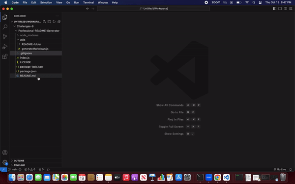

# Professional README Generator
  

  ## Description

  This command-line application used to quickly and easily generate a high-quality README.md for any of your projects on Github. Using user input, the application will dynamically generate a README that includesthe name of the project, a description, how to use it, how to install it, how to report issues, and how to make contributions.

  ## Table of Contents

  - [Installation](#installation)
  - [Usage](#usage)
  - [Contributing](#contributing)
  - [Tests](#tests)
  - [License](#license)
  - [Questions](#questions)

  ## Installation

  To install, open the command-line and type in the command 'npm i' to install inquirer.

  ## Usage

  After installation, type in 'node index.js' in your command-line. From there, a series of questions about your project will be asked. Please answer each one of the them. Once all of the questions have been answered, the application will take your answers and automatically generate a README.md that you can find in the README-folder in the utils folder.

  

  ## Contributing

  All are welcome to contribute! Before contributing, please fork the repo, create a local branch, and create a pull request for any changes you'd like to make. Following a code review, your code will be merged.

  ## Tests

  N/A

  ## Technologies

  - Node.js
  - Inquirer.js
  
  ## License
  
  This is licensed under Mozilla.

  For more information about the license used for this project, please refer to the
  [Mozilla License](https://choosealicense.com/licenses/Mozilla/).

  ## Questions

  For any questions or to report any issues, please feel free to check out my Github profile or reach out via email:
  - [Github Profile](https://github.com/libbyou)
  - Email: <lcyou95@gmail.com>